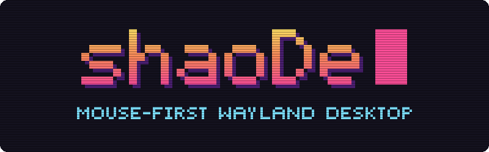

<h1 align="center"></h1>

A mouse-first Wayland desktop with Lua configuration, floating windows,
edge snapping, and optional Hyprland-style automatic tiling. C++ owns configuration and desktop policy;
a C adapter integrates wlroots. A Qt Quick shell adds a desktop, taskbar, and
searchable application launcher.

This is an early development project, not a replacement desktop session yet.

## Build and run

The first working compositor supports real Wayland applications, focus follows mouse,
mouse move/resize, configurable shortcuts, half-screen snapping, maximize/restore,
a one-shot grid arrangement, automatic dwindle tiling that can be switched on and
off, workspaces, and Lua reload. It uses a TinyWL-derived C adapter
with C++ configuration and placement policy. The Qt shell runs live
through LayerShellQt, with a panel and desktop on every monitor.

Requirements: CMake 3.25+, C11 and C++20 compilers, pkg-config, Lua 5.4,
xkbcommon, wlroots **0.20.x**, wayland-server, wayland-protocols, and
wayland-scanner. The shell also needs Qt 6.5+ (Core, Gui, Network, Qml, Quick, Quick Controls
Basic, Quick Layouts, and the Wayland platform plugin), LayerShellQt 6.6+, GLib/GIO,
and wayland-client. Tests use Python 3. Ninja is used below.
Gentoo setup and standalone-session instructions are in [docs/gentoo.md](docs/gentoo.md).
The build supports a normal install prefix and DESTDIR staging.

```sh
cmake -S . -B build -G Ninja -DSHAODE_BUILD_COMPOSITOR=ON
cmake --build build
ctest --test-dir build --output-on-failure
./build/shaode --config config/init.lua --check-config
./build/shaode --config config/init.lua --exec kitty
```

The compositor opens a nested window in the current Wayland session.
It selects only the Wayland backend; `--headless` selects the headless backend
for testing. The separate `--session` option selects DRM/libinput from a TTY; that physical
backend is experimental: it has run on an AMD laptop (one built-in screen) and an
NVIDIA desktop with three monitors; hotplug and suspend are untested. Session-file
installation is opt-in with `SHAODE_INSTALL_SESSION=ON`.
Applications launched through `--exec`, startup entries, or bindings inherit
the nested Wayland socket. Commands after `--exec` consume all remaining
arguments; there is no shell expansion. Full builds start the desktop shell
automatically; `--no-shell` or Lua `shell.enabled = false` disables it. Headless
mode never starts the shell automatically. No other applications start
automatically with the example configuration.

The shell has pinned desktop shortcuts (double-click to launch), a taskbar with
window activation/minimization and a right-click window menu, an application
search menu, a tiling on/off button, a clock, and a show-desktop button. Installed applications are read
from desktop entries through GIO. Lua configures the panel's height, top or
bottom placement (`panel_position`), margins that make it float (`panel_margin`, one
number or `{ top, right, bottom, left }`), corner radius, font and text size, colors
(`#RRGGBB`, or `#RRGGBBAA` for a translucent panel), wallpaper, and pinned commands. Pinned commands run from your home directory. In a nested
session, applications that reuse an existing process or D-Bus service can open
in the host session instead.

Default bindings (edit [config/init.lua](config/init.lua)):

| Input | Action |
| --- | --- |
| Super + left/right drag | Move / resize a window (on a tile: move it, or move its splits) |
| Super + Q | Launch Kitty |
| Super + R | Open or close the application menu on the monitor under the pointer |
| Super + C | Close focused window |
| Super + M | Exit shaoDe |
| Super + V | Float or tile the focused window |
| Super + F | Toggle fullscreen |
| Super + T | Arrange the current output's windows in a grid (floating mode) |
| Super + Shift + T | Turn automatic tiling on or off |
| Alt + Tab | Cycle windows |
| Super + Left/Right/Up/Down | Focus the nearest window in that direction |
| Super + Shift + Left/Right | Snap to half the output |
| Super + Shift + Up/Down | Maximize / restore saved floating geometry |
| Super + 1–4 | Switch to workspace 1–4 |
| Super + Shift + 1–4 | Move the focused window to workspace 1–4 |
| Super + Ctrl + Left/Right | Previous / next workspace |
| Super + Shift + R | Reload Lua configuration |

The host compositor can consume shortcuts before the nested compositor receives
them: a host that grabs Super (Hyprland, GNOME) keeps these, so set `mod = "Alt"` in
the Lua file for nested sessions. SIGHUP also requests a reload, and
SIGINT/SIGTERM requests shutdown. A reload does not rerun startup commands.

Windows that leave decorations to the window manager (Wayland applications that support
server-side decorations, such as kitty, and X11 applications such as Spotify) get no title
bar. Instead, three small macOS-style dots sit over their top-right corner (minimize,
fullscreen, and close, from left to right) and appear when the pointer nears that corner, so they never cover text.
Dragging the pill around the dots moves the window. Other windows decorate themselves.

Dropping a dragged window with the pointer at the top edge of the screen, or on a panel along
it, makes it fullscreen; dragging a fullscreen window away restores its earlier size. Hovering a
window focuses it without raising it (`mouse.focus_follows = false` turns this off), except
while dragging, while a menu or popup is open, or while a panel or launcher has the keyboard.

Limitations: snapping is keyboard-driven, without edge-drag previews. Fullscreen covers the panel while the window is focused;
focusing another window lowers it behind the panel until it is refocused. Window
placement during interactive resize is immediate, without waiting for the
client's next buffer.

## Tiling

The tiling button on the panel (next to the clock), Super + Shift + T, or
`shaode msg toggle_tiling` switches between floating windows and automatic tiling;
Lua `layout.tiling = true` starts tiled. Tiling follows Hyprland's default *dwindle*
layout: every output and workspace has its own binary split tree, each split divides
its space along the longer side, and a new window opens on the output under the
pointer, splitting the focused window there (or the one under the pointer) on the side
nearer the pointer. Floating windows also open on the pointer's output. Closing a window gives its
space back to its neighbour.

- Mod + right drag on a tile, or dragging its edge, moves the split lines around it.
- Moving a tile (Mod + left drag or its title bar) lifts it out; dropping it splits
  the tile under the pointer.
- Dialogs and fixed-size windows float. Super + V (`toggle_floating`) floats
  or tiles the focused window; snapping or maximizing a tile also floats it.
- Turning tiling off returns every window to its floating position and size.
- Minimized windows leave the tiling and rejoin it when restored; windows moved to
  another workspace join that workspace's tiling on the same output.

Not yet: keyboard focus/swap between neighbouring tiles, per-workspace on/off, and
keeping floating windows above tiles. Windows tiled on a monitor that is unplugged
keep their place until it returns.

Pointer devices in a standalone `--session` take `mouse.speed` (-1 to 1),
`mouse.acceleration` (`"flat"` or `"adaptive"`), and `mouse.natural_scroll`; touchpads also
take `touchpad.natural_scroll`, `tap_to_click`, and `disable_while_typing`. Unset settings
keep each device's defaults, and a reload applies changes. Nested sessions get their pointer
from the host, so these do nothing there.

`layout.gap` sets the space around tiles; `gap_inner` (between windows) and `gap_outer`
(at the output's edges) set them separately. Hyprland's `gaps_in` is half of `gap_inner`,
since Hyprland adds it on both sides. The `windows` table draws a border around each window
(`border_width`, `border_color` for the focused one, `border_inactive_color`) and sets
`opacity` and `inactive_opacity`, per application too with `rules` matched against the app
ID. Fullscreen windows have no border and stay opaque. Rounded corners, blur, and shadows
need a renderer that wlroots' scene graph does not provide.

Every monitor has its own workspaces, numbered 1 to `layout.workspaces` (1–10), and all
start on 1. Workspace shortcuts switch the focused monitor: the one whose window was
focused, whose workspace was switched, or that was clicked last. A window belongs to the
monitor it is on; moved to another monitor, it joins the workspace showing there. The
panel on each monitor shows that monitor's workspaces, marking the current one and those
with windows; scrolling over it pages through them and clicking a number switches to it.
The taskbar lists windows from every workspace, and activating one switches its monitor
to its workspace. Window shortcuts act only on visible windows.

Portals run as D-Bus services, started with the bus's environment rather than the
compositor's. A standalone `--session` therefore exports `WAYLAND_DISPLAY`, `DISPLAY`,
`XDG_CURRENT_DESKTOP=shaoDe`, `XDG_SESSION_TYPE`, and `SHAODE_SOCKET` with
`dbus-update-activation-environment --systemd` before it starts anything; the nested mode
leaves the host's portals alone, so its applications share and pick files through the host.
The installed `shaode-portals.conf` selects `xdg-desktop-portal-wlr` for screen sharing and
screenshots and `xdg-desktop-portal-gtk` for everything else. Install both, plus PipeWire
and `slurp` (the wlr portal's monitor picker on multi-monitor setups). An
`xdg-desktop-portal` that is already running keeps the desktop it started with; after
leaving another desktop, run `systemctl --user restart xdg-desktop-portal` once or log out
fully. The session also sets `MOZ_ENABLE_WAYLAND=1`, `ELECTRON_OZONE_PLATFORM_HINT=auto`,
and `_JAVA_AWT_WM_NONREPARENTING=1` unless they are already set.

Monitors sit side by side, top-aligned. `outputs.order` lists connector names
(such as `DP-3`) left to right; unlisted monitors follow on the right in the order
they appear. `outputs.primary` puts that monitor at the layout origin, where the
cursor starts. By default each monitor runs its preferred resolution at the fastest
refresh rate available for it. `outputs.monitors`, keyed by connector name, overrides
that per monitor:

```lua
outputs = {
    primary = "DP-3",
    monitors = {
        ["DP-3"] = { mode = "2560x1440@200", scale = 1.25, position = { x = 0, y = 0 } },
        ["HDMI-A-1"] = { mode = "2560x1440@144", position = { x = -2048, y = 0 } },
        ["DP-1"] = { enabled = false },
    },
},
```

`mode` is `WIDTHxHEIGHT` or `WIDTHxHEIGHT@HZ`; the closest refresh rate at that
resolution wins. `scale` is fractional, `transform` takes Hyprland's (and Wayland's)
0–7, and `enabled = false` turns a monitor off (never the last one), and `vrr = true` enables
adaptive sync where the monitor supports it. A key such as `["desc:ASUSTek COMPUTER INC
VG27AQ3A"]` matches the start of a monitor's "make model serial" (listed by `shaode msg get
outputs`), as Hyprland's `desc:` does; a connector-name key wins over it. Monitors with a
`position` go there, in logical pixels after scaling; the rest follow in a row to their
right. `shaode msg get outputs` prints what each monitor ended up with. Reloading
applies changes without restarting.

`shaode import ~/.config` carries an existing Hyprland/Waybar setup over: monitors, colors
(wallbash or pywal), bar look, gaps, borders, opacity, input, and wallpaper. It runs
`hyprland.lua` in a sandbox (or parses `hyprland.conf`), writes `theme.lua` beside the
configuration, and reports where each value came from and what it skipped. `init.lua` loads
it with `theme = "theme.lua"` and overrides any of it; `--dry-run` only prints. See
[docs/dotfile-import.md](docs/dotfile-import.md) for the details and for the settings shaoDe
still lacks (rounding, blur, shadows).

A control socket runs any Lua action from scripts or other tools:
`shaode msg workspace 2`, `shaode msg toggle_tiling`, `shaode msg spawn foot`. Prefixing
`output NAME` makes workspace actions switch that monitor instead of the focused one:
`shaode msg output HDMI-A-1 workspace_next`. The query
`shaode msg get workspace` prints the focused monitor's workspace, `shaode msg get workspaces`
prints one tab-separated line per monitor (name, current workspace, focused, and the
workspaces holding windows, such as `1,3`, or `-`), `shaode msg get tiling` prints
`on` or `off`, `shaode msg get outputs` prints one tab-separated line per monitor (name,
enabled, x, y, logical width and height, scale, transform, mode, and "make model serial"), and
`shaode msg get windows` prints one tab-separated line per window:
workspace, focused, minimized, tiled, x, y, width, height, app ID, title, monitor, and
visible. A client that sends `subscribe` keeps its connection and receives `tiling on|off`,
`workspace N` (the focused monitor's), and one `output NAME N USED` line per monitor (as in
`get workspaces`) after every change, plus `launcher OUTPUT` when the `launcher` action
(Super + R) asks the panel on that monitor to open or close its application menu; the panel uses this. Children of the session find the socket through `SHAODE_SOCKET`. Actions are
refused while the session is locked.

Screen locking uses the standard `ext-session-lock-v1` protocol, so lockers such
as swaylock or gtklock work; bind one with a `spawn` action. The desktop is covered
before the locker draws, only the locker receives input, and if it crashes the
session stays locked until a new locker takes over. Idle notification and idle
inhibition (`ext-idle-notify-v1`, `idle-inhibit-unstable-v1`) let swayidle lock
or blank after inactivity while video players keep the session awake.

Browsers and Electron applications (Firefox, Chromium, Discord) get the protocols they
look for: GPU buffers through linux-dmabuf with explicit sync where the driver supports it,
viewporter, fractional scaling, presentation timing, xdg-output, middle-click paste
(primary selection), clipboard managers (`wl-clipboard`, data-control), drag-and-drop,
pointer lock and relative motion for games, and xdg-foreign for portal dialogs.
xdg-activation lets an application raise itself, so a link clicked in a chat brings the
browser forward; shaoDe honours every valid token and does not prevent focus stealing.
Popup menus are kept on the output of their window.

Screenshots and screen sharing use wlr-screencopy, export-dmabuf, and
ext-image-copy-capture, so `grim` works directly and Discord, OBS, or a browser share a
monitor or a single window through xdg-desktop-portal-wlr. A shared window is drawn on
its own, without whatever overlaps it, and keeps streaming while minimized or on another
workspace.

X11 applications run through XWayland when wlroots is built with X support and
`Xwayland` is installed. `DISPLAY` is set from the start, but Xwayland only
starts when the first X11 client connects and exits again once idle (Lua
`xwayland = false` disables it; changing it needs a restart). X11 windows take
part in focus, the taskbar, snapping, maximize, and fullscreen like Wayland windows.

wlroots' X11 window manager can leave events unprocessed, which loses the
first window after Xwayland starts. Until wlroots fixes this, shaoDe nudges the
window manager every 250 ms while Xwayland runs. With wlroots patched by
`packaging/patches/wlroots-xwm-drain.patch`, configure with
`-DSHAODE_XWM_WAKER=OFF` to drop the workaround.
Lua currently configures the exposed settings/actions; custom layout functions
and shell widgets are later work.

## Configuration and testing

Lua configuration returns a versioned table. Settings and shortcuts are validated
before application; an invalid reload retains the active configuration. Lua can
use base functions, tables, strings, math, and UTF-8 to compute settings. Process
and file I/O libraries are not exposed. Configuration is user-controlled code;
the evaluator is not a security boundary for untrusted scripts.

Without `--config`, the executable looks for `$XDG_CONFIG_HOME/shaode/init.lua`,
or `~/.config/shaode/init.lua` when `XDG_CONFIG_HOME` is unset, then falls back
to the installed example under the configured data directory. It never creates
or overwrites a personal configuration automatically.

CTest covers configuration validation, grid and dwindle layout bounds/non-overlap,
and a headless compositor with real xdg-shell clients. The integration tests verify
mapping, frame callbacks, maximize/restore, unmapping, accepted/rejected reloads,
workspaces, tiling on/off with splitting and floating, session locking, XWayland
(when available), and clean shutdown in an isolated temporary runtime directory. Shell builds also render
both QML surfaces using Qt's offscreen software backend. No display session is needed.

To build the compositor without Qt, add `-DSHAODE_BUILD_SHELL=OFF`. To work on
the shell UI without LayerShellQt, use an explicit preview build:

```sh
cmake -S . -B build-preview -G Ninja -DSHAODE_SHELL_PREVIEW_ONLY=ON
cmake --build build-preview
ctest --test-dir build-preview --output-on-failure
./build-preview/shaode-shell --config config/init.lua --preview
./build-preview/shaode-shell --config config/init.lua --preview --preview-desktop
```

Preview builds do not install or automatically launch the shell. Preview windows
show the UI and can launch applications, but do not manage windows or reserve
space on the host desktop.

To build only the configuration, placement, and tiling tests without wlroots:

```sh
cmake -S . -B build-config -G Ninja -DSHAODE_BUILD_COMPOSITOR=OFF
cmake --build build-config
ctest --test-dir build-config --output-on-failure
```

See [docs/verification.md](docs/verification.md) for the actual test results and
remaining limitations.

## Development sequence

1. **Done:** Lua configuration and native build foundation.
2. **Done:** nested wlroots compositor: real applications, focus, move/resize, shortcuts,
   background, snapping, basic tiling, and reload.
3. **Done:** Qt Quick shell: taskbar, launcher, desktop shortcuts, wallpaper and
   icons, verified live on physical hardware.
4. **Done:** automatic dwindle tiling with a panel toggle. Next: drag-to-edge previews,
   window rules, and Lua extension APIs shared by mouse controls and shortcuts.
5. Session integration: notifications, tray, power and audio controls. Done: portals,
   screen sharing, and monitor order.

The compositor targets wlroots 0.20 specifically, because its API changes
between release series. Develop nested inside the existing Wayland session first.

## Upstream references

- [wlroots API](https://wlroots.pages.freedesktop.org/wlroots/)
- [TinyWL 0.20.2](https://gitlab.freedesktop.org/wlroots/wlroots/-/tree/0.20.2/tinywl)
- [Lua 5.4 API](https://www.lua.org/manual/5.4/manual.html)
- [Hyprland dwindle layout](https://wiki.hypr.land/configuring/layouts/dwindle-layout/),
  the model for shaoDe's tiling (reimplemented, no Hyprland code is included)

## License

shaoDe is free software, licensed under the GNU General Public License,
version 3 or (at your option) any later version. See [LICENSE](LICENSE).

The compositor adapter derives from TinyWL. Its upstream MIT license is
preserved in [vendor/tinywl/LICENSE](vendor/tinywl/LICENSE). The protocol
files in `protocols/` keep the licenses stated in each file.
